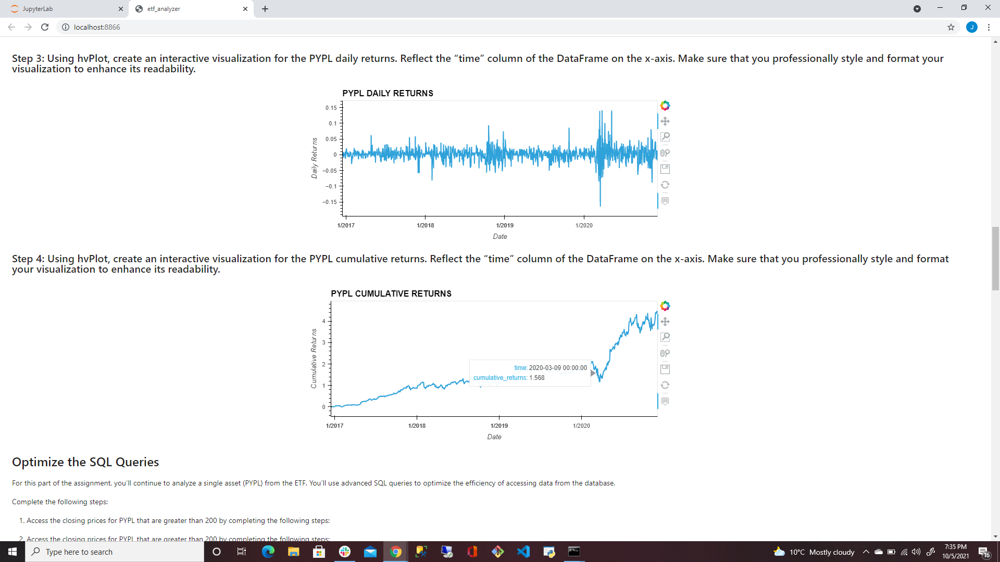

# Module 7 Challenge - Create a Web Application for an EFT Analyzer

---

## Description

In this Jupyter Lab Notebook, we build a financial database and a web application by using SQL, Python, and the Voila library to analyzed the performance of a hypothetical ETF.  

In this assignment we analyze a hypothetical ETF that consists of four stocks: GOST, GS, PYPL and SQ.  By using our new skills learned using the sqlalchemy library, we read in a database with the starting information to begin our analysis. 

The sections of this notebook are as follows: 

1. Analyze a single asset in the ETF
2. Optimize data access with Advance SQL queries
3. Analyze the EFT portfolio
4. Deploy the notebook as a web application.

An example of the notebook deployed as a web application can be seen in the following screenshot of a desktop running the applicaiton: 



---

## Technologies

This project leverages JupyterLab Version 3.0.14 in association with Anaconda distribution and the Conda package manager.  The following packages are also used: 

* [pandas](https://github.com/pandas-dev/pandas) - Data analysis toolkit for Python.

* [sqlalchemy](https://github.com/sqlalchemy/sqlalchemy) - The Python SQL Toolkit and Object Relational Mapper

* [hvPlot](https://github.com/holoviz/hvplot) - A high-level plotting API for the PyData ecosystem built on HoloViews.

* [voila](https://github.com/voila-dashboards/voila) - Rendering of live jupyter notebooks with interactive widgets.

---

## Installation Guide

Before running the application, install Python modules Pandas, hvPlot, SQLAlchemy and Voila:

```python

  conda install pandas

  conda install -c pyviz hvplot

  pip install SQLAlchemy

  conda install -c conda-forge voila
```
---

## Contributors

Joshua Creveling

Email: josh.creveling22@gmail.com

GitHub: https://github.com/joshuacreveling

LinkedIn: https://www.linkedin.com/in/joshua-creveling/

*Starter template provided by Trilogy Education Services*

---

## License

MIT

